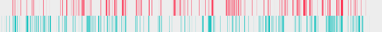
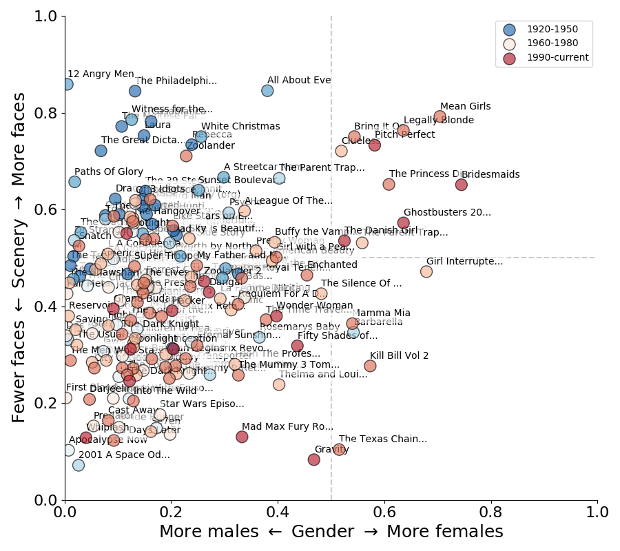
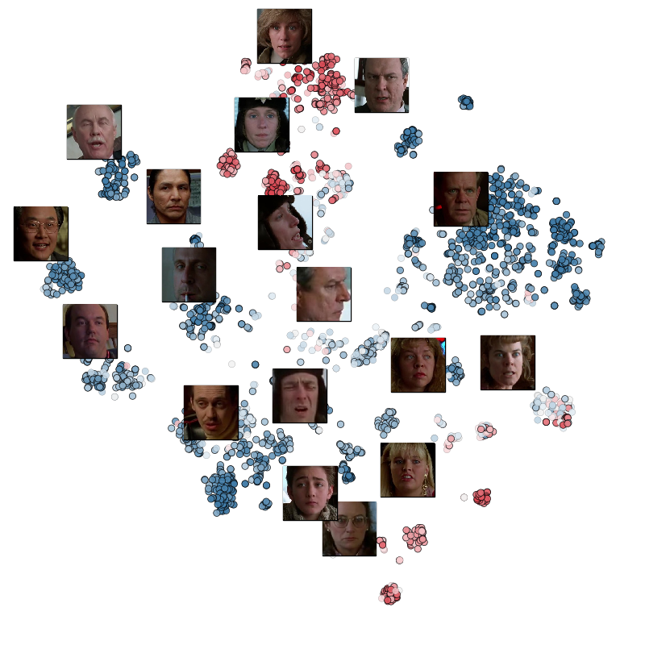
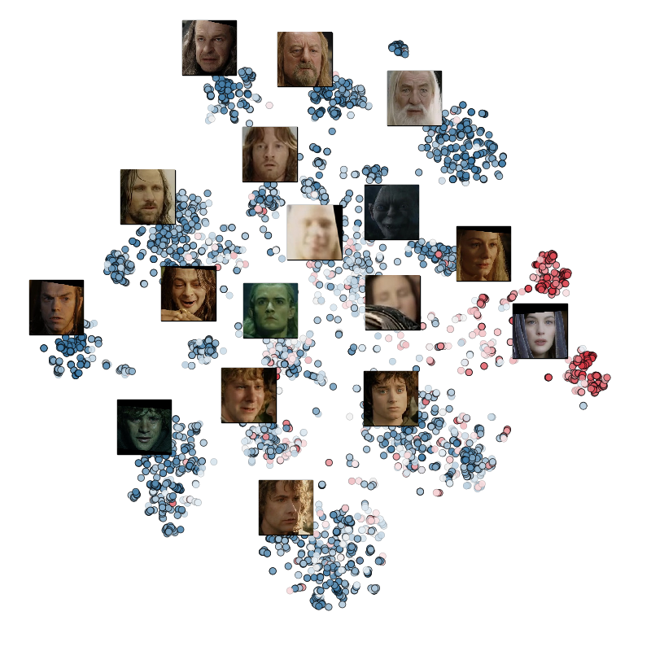

# Girls, Interrupted

A computational study on the faces in the movies.
We examine both the fraction of time a face is detected, and the fraction
of scenes we detect a male or female face.

For example, consider Dirty Dancing, which features an even mixture of the two main characters, Pitch Perfect, a predominately female movie, and 12 Angry Men, a male dominated feature: 

**Dirty Dancing**, _1987_

**Pitch Perfect**, _2012_

**12 Angry Men**, _1957_

Each tick represents one second of the film, a pink mark for females is on top, and a blue mark for males is on the bottom.

## [All line plots for 175 movies](docs/gallery_figures.md)

Coloring the dots by year (blue earlier, red later), old Hollywood takes up the upper left, recent girl comedies take the upper right, romance in the middle, and most movies are lower left. That is, most movies feature less faces, but those that are shown are male.

For movies that have been scored on the [Bechdel test](https://shannonvturner.com/bechdel/what), there is a strong correlation between movie screen time and passing the test:

There is a significant trend in cinematography in the late 60s-70s to use less faces (the era of the blockbuster), but there isn't as strong as a shift in male to female ratios.

We can take a single movie, create a face embedding for each face, then compute a tSNE plot of the faces. Each dot is a face in a scene and color by the detected gender. Clumps are illustrated with a representative snapshot.

**Fargo**, _1996_

**The Lord of Rings: The Return of the King**, _2003_

## [All tSNE plots plots for 175 movies](figures/tSNE/images/)